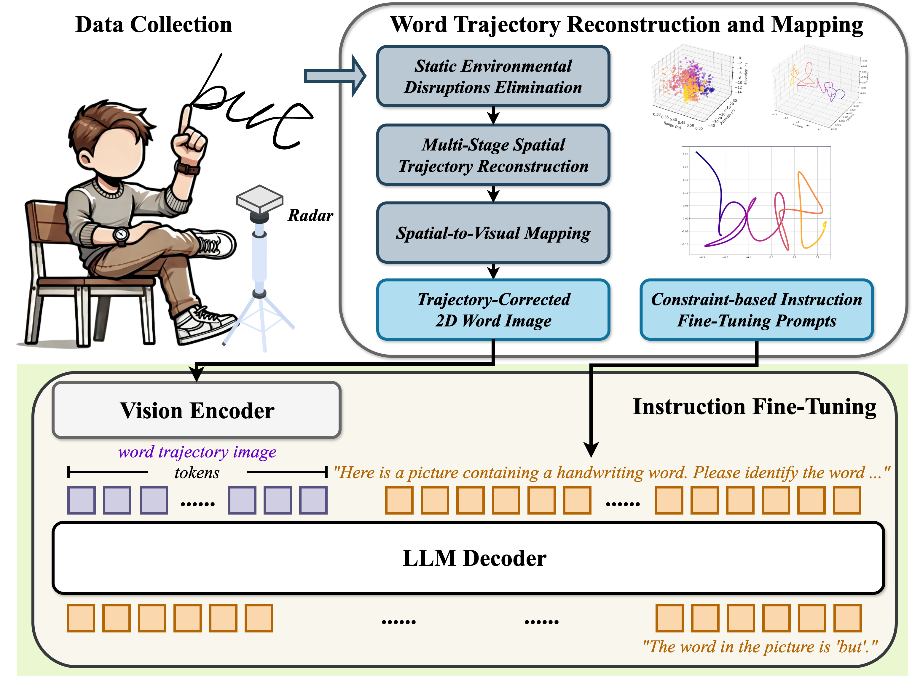

# ✍ mmPencil: Toward Writing-Style-Independent In-Air Handwriting Recognition via mmWave Radar and Large Vision-Language Model

In this paper, we propose $𝑚^2𝑉𝐿𝑀𝑠$, a modality mapping architecture, which serves as a bridge between the millimeter-wave (mmWave) radar sensing technologies and large vision-language models (VLMs). Based on the proposed architecture, a three-dimensional (3D) in-air handwriting word recognition system named **mmPencil** is developed. 

We also collect and release a [3D mmWave handwriting dataset](https://www.kaggle.com/datasets/mmpencil/mmpencil-dataset/data) comprising 200 distinct words (ranging from 2 to 9 letters), contributions from 12 users, and 22 different writing scenarios, totaling 7,664 samples with an overall size of 31.66 GB.

> 🔥🔥🔥 mmPencil has been accepted to ACM UbiComp / IMWUT 2025.



***
## 🔧 Environment Setup

### 📥 Clone the Project Repository
```bash
git clone https://github.com/1YifanGuo/mmPencil.git
cd mmPencil
```

### 🐍 Create a Conda Environment
```bash
conda create -n mmPencil python=3.10
```

### 📦 Manually Install Dependencies
> Install ms-swift
```bash
pip install -U ms-swift
```
```bash
pip install pykalman scikit-learn torchvision==0.18.1
```
> Install the required dependencies to support Qwen2-VL
```bash
pip install -U "qwen_vl_utils>=0.0.6" "decord"
pip install verovio
```
> Install the required dependencies to support GOT-OCR
```bash
pip install transformers==4.48.0 peft==0.11.1
```

### ⚙️ Automatically Install All Dependencies (Optional)
```bash
conda env create -f environment.yml
```
***
## 📁 Data and Model Preparation
### 💾 Download mmpencil Dataset
> Create dataset directory
```bash
mkdir -p mmPencil_dataset
```
> Download dataset from kaggle
```bash
curl -L -o mmPencil_dataset/mmpencil-dataset.zip \
  https://www.kaggle.com/api/v1/datasets/download/mmpencil/mmpencil-dataset
```
> Unzip to path mmPencil/mmPencil_dataset/mmWave
```bash
unzip mmPencil_dataset/mmpencil-dataset.zip -d mmPencil_dataset/mmWave
```
### 🧠 Download VLMs
> Create model directory
```bash
mkdir -p models
```
> Download models
```bash
git lfs install
git clone https://huggingface.co/Qwen/Qwen2-VL-7B-Instruct
git clone https://huggingface.co/llava-hf/llava-v1.6-mistral-7b-hf
git clone https://huggingface.co/stepfun-ai/GOT-OCR2_0
```
### ✅ Recommended Project Directory Structure
```bash
mmPencil/
├── mmPencil_dataset/                # Directory for datasets
│   └── mmWave/
│
└── models/                          # Directory for vision-language models
    ├── Qwen2-VL-7B-Instruct/
    ├── llava-v1.6-mistral-7b-hf/
    └── GOT-OCR2_0/
```
***
## 🚀 Usage
### 1. Convert mmWave Signals to Vision-Language Data
```bash
python3 mmwave_to_image_text.py
```
> A vision-language instruction fine-tuning sample mapped from one set of mmWave data.
```json
{"messages": 
	[
		{
			"role": "user", 
	     	"content": "<image>Here is a picture containing a handwriting word. Please identify the word in the image. Ensure that your output is a correctly spelled English word. Note: Only provide the word itself, without any additional content or explanation."
		}, 
		{
			"role": "assistant",
			"content": "really"
		}
	], 
	"images": ["mmPencil_dataset/vision/User-01/200-Word/really/w1.png"]
}
```
### 2. Split Dataset into Train / Test
```bash
python3 train_test_split.py
```
### 3. Fine-tune the Vision-Language Model
> For example, fine-tuning the Qwen2-VL in the cross-user dataset
```bash
bash scripts/finetune/finetune_qwen2-vl_cross-user.sh
```
> Fine-tuning the GOT-OCR in the non-cross-user dataset
```bash
bash scripts/finetune/finetune_got-ocr_non-cross-user.sh
```
...
### 4. Run Batch Inference
> ⚠️ Make sure to replace PATH_TO_ADAPTER_CHECKPOINT with the path to your actual adapter checkpoint
```bash
bash scripts/inference.sh
```
### 5. Evaluate Inference Results
```bash
python3 evaluation.py mmpencil-<model>/<checkpoint>/infer_result/<timestamp>.jsonl
```
***
## 📚 Citation
If you find anything useful in our project or dataset, please consider citing it as follows:
```bibtex
@misc{yifan_guo_zhu_wang_qian_qin_yangqian_lei_qiwen_gan_zhuo_sun_chao_chen_bin_guo_zhiwen_yu_2025,
	title={mmpencil-dataset},
	url={https://www.kaggle.com/dsv/11612847},
	DOI={10.34740/KAGGLE/DSV/11612847},
	publisher={Kaggle},
	author={Yifan Guo and Zhu Wang and Qian Qin and Yangqian Lei and Qiwen Gan and Zhuo Sun and Chao Chen and Bin Guo and Zhiwen Yu},
	year={2025}
}
```
***
## ✅ Acknowledgements

Grateful acknowledgment for the efficient fine-tuning support from [ms-swift](https://github.com/modelscope/ms-swift) and [LLaMA-Factory](https://github.com/hiyouga/LLaMA-Factory). Thanks to the open-source VLMs [Qwen2-VL](https://github.com/QwenLM/Qwen2.5-VL), [LLaVA-Next](https://github.com/LLaVA-VL/LLaVA-NeXT), and [GOT-OCR](https://github.com/Ucas-HaoranWei/GOT-OCR2.0). Acknowledgement for the support provided by the authors of [MMHTSR_DATASET](https://github.com/Tkwer/MMHTSR_DATASET).